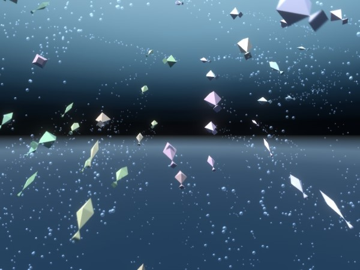

To Fish
====

Unityの各種エフェクト（シェーダー、パーティクル、ポストプロセス）を使用したデモコンテンツです。

## ビルド手順
Unity 2018 3.6でプロジェクトを開いてください。

以下のアセットを使用しているため、ストアから導入が必要です。  
* [UniRx](https://assetstore.unity.com/packages/tools/integration/unirx-reactive-extensions-for-unity-17276)

## ライセンス
[MIT](LICENSE)

## 作成者
[yamada1ta](https://github.com/yamada1ta)
